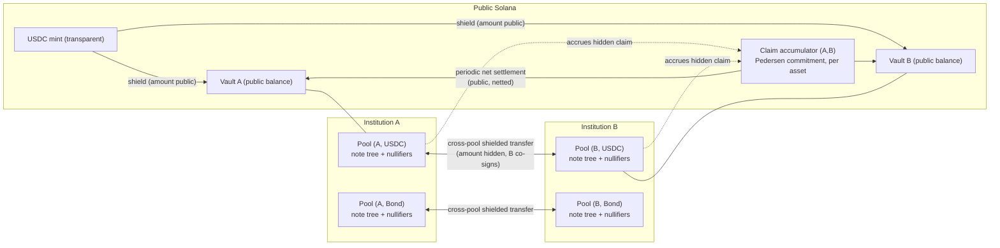
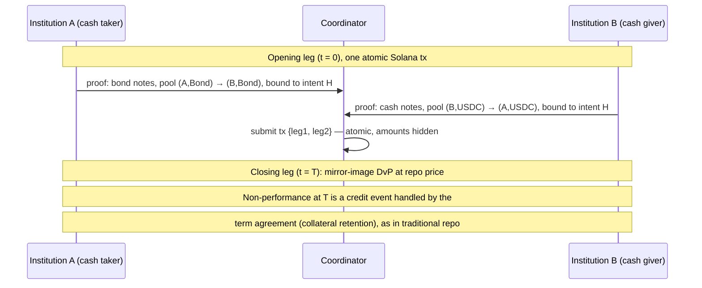

# Per-Institution Shielded Pools — High-Level Design

Status: v2 redesign. Supersedes the previous two-layer (Zether + shared
pool) design in full; requirements and locked decisions live in
[goal.md](goal.md). This document describes the architecture; a
constraint-level spec follows separately.

---

## 1. Design Summary

A **matrix of Zcash-style shielded pools, one per (institution, asset)**,
deployed as programs on unmodified Solana, all proven on a single stack
(Groth16 / Baby Jubjub / Poseidon over BN254).

- Every institution custodies every asset it handles in **its own pools**.
  Resting funds of one institution (and its clients) never enter another
  institution's pool — no commingling anywhere (R1).
- Value moves between institutions via **cross-pool shielded transfers**:
  a note is burned in pool `(A, X)` and minted in pool `(B, X)` under a ZK
  conservation proof; the amount is never public (R6). Each such transfer
  accrues a **bilateral claim** from A to B, net-settled periodically in
  the public base asset (D1).
- Amounts and balances are hidden everywhere inside the system (R3);
  in-pool unlinkability is Zcash-style membership over the whole pool (R4);
  zero-value dummy transactions are indistinguishable from real ones by
  construction (R5).
- The issuing institution can audit its own asset via circuit-enforced
  auditor ciphertexts — read-only, no spend authority (R7).
- Repo/DvP is built from Solana transaction atomicity plus an intent-hash
  binding in each leg's proof — no shielded VM, no binding signatures (D3,
  R8).

What this design deliberately does **not** have (vs. the previous design):
no shared anonymity pool, no hidden asset IDs, no ZK registry-membership
machinery, no Zether account layer, no curve25519/BN254 gap in the core.

---

## 2. Architecture

### 2.1 The pool unit

A pool is identified by `(custodian institution, asset)`. It consists of:

- a **note commitment tree** (Poseidon Merkle tree): each leaf commits to
  `(value, owner_pk, randomness)` — no asset field, because the pool itself
  fixes the asset;
- a **nullifier set** preventing double-spends without revealing which
  note was spent;
- the custodian's **audit public key** and (for wrapped public assets) a
  **public vault** holding the base-asset backing.

Clients of institution A hold notes in A's pools. In-pool transfers
(Alice → Bob, both clients of A) are standard shielded actions: spend
notes, emit nullifiers, create output notes, prove conservation and range
in ZK. Fixed transaction arity (e.g. 2-in/2-out, padded with zero-value
notes) keeps every transaction shape-identical.

### 2.2 Entry and exit (shield / unshield)

For a wrapped public asset (e.g. USDC): a user deposits public USDC into
pool `(A, USDC)`'s vault and receives a note; unshield is the reverse.
**Boundary amounts against a transparent base asset are necessarily
public** — identical leakage to the wrapped-mint variant discussed in
[discussions.md](discussions.md), where the `USDC → USDC.bofa` wrap is
equally visible. Everything after the boundary is hidden.

For a natively confidential asset (e.g. a bond issued by institution A):
issuance mints notes directly into pool `(A, Bond)` with no public
amount at all; the outstanding supply is known only to the issuer (via
its audit key). There is no vault and no public base.

### 2.3 Cross-pool shielded transfer

The single mechanism for inter-institution value movement. To move value
from pool `(A, X)` to pool `(B, X)`:

1. the sender spends notes in `(A, X)` (nullifiers against A's tree) and
   creates output notes in `(B, X)`, in one proof spanning both trees;
   conservation and range are proven in ZK; the amount is never public;
2. the output notes carry auditor ciphertexts under **B's** audit key
   (B now custodies them) and the transfer carries an amount ciphertext
   under **A's** key as well, so both counterparties — and only they —
   learn the amount (need-to-know, R6);
3. **B co-signs the transaction.** This is B's acceptance of A's IOU and
   its real-time exposure-limit control: B can decrypt the incoming
   amount and refuse to sign past its bilateral credit limit with A;
4. the on-chain **claim accumulator** for the ordered pair `(A→B, X)` — a
   Pedersen commitment — is updated homomorphically, with the circuit
   proving the update matches the hidden transferred value. Both
   institutions track the plaintext net position off-chain (each decrypts
   every transfer's amount); no one else can.

Assumption made here (flagged, not from discussions): cross-pool minting
is gated by the receiving institution's signature. This makes the
receiving institution a required online party for incoming transfers,
which matches institutional practice (a bank must accept an incoming
correspondent-banking credit) but should be confirmed.

### 2.4 Settlement (D1)

Bilateral claims are backed by **bilateral credit lines with periodic net
settlement**:

- at each settlement, A and B co-sign the plaintext net position `n` for
  the period (both know it; the on-chain program checks the co-signature
  and optionally a ZK opening of the accumulator against `n`), transfer
  `n` units of the public base asset between vaults, and reset the
  accumulator;
- for natively confidential assets there is no public base; settlement is
  issuer-mediated: the issuer burns claim-backing notes in one pool and
  mints in the other, confidentially.

**Honest leakage statement (R2).** For wrapped public assets, vault
balances are public at all times. What is hidden is the *divergence*
between vault balances and true positions — i.e. the intra-period
bilateral claims — plus all gross flows, counterparty amounts, and
individual transactions. Each settlement reveals one net flow per
counterparty pair per period. The settlement cadence is therefore the
leakage-granularity knob: longer periods leak less but carry more
bilateral credit exposure; it is a per-institution configuration, not a
protocol constant. For natively confidential assets, TVL and supply are
fully hidden from everyone but the issuer. This is the same guarantee the
wrapped-mint scheme in the discussions actually provides, stated
precisely.

---

## 3. Anonymity

- **Within a pool (R4):** deposits and withdrawals are unlinkable via
  membership proofs over the full note set — the anonymity set is the
  entire history of the pool, not a sender-chosen ring. Ring-based
  designs (anonymous Zether / PGC) were rejected in the discussions for
  weaker privacy and 10–27 KB transactions.
- **Dummy traffic (R5):** zero-value notes are native to the Zcash-style
  action structure; since all amounts are hidden and all transactions are
  shape-identical, dummy in-pool churn and real transfers are
  cryptographically indistinguishable. The institution (or a relayer) can
  inflate its pool's apparent volume at will. Fee economics and cadence
  are open (goal.md §6.4).
- **Across pools (open — goal.md §6.1):** a cross-pool transfer touches
  both pool programs, so the *pair* of institutions (not the amount, not
  the parties within each pool) is publicly visible. Mitigations if
  required: zero-value dummy cross-pool transfers on a schedule, and/or
  batching through a router program. Whether pair-visibility is
  acceptable leakage needs confirmation from the institutional side.

---

## 4. Auditability (R7)

Every output note carries an **auditor ciphertext** — an exponential
ElGamal encryption (over Baby Jubjub) of the note's value under the
custodian institution's registered audit key — and the circuit constrains
it to match the committed value. Consequently:

- the custodian can decrypt the values flowing through its own pools,
  wherever they move, with no trusted third party;
- it cannot decrypt any other institution's pool traffic (different audit
  keys), and its audit key confers no spend authority — audit is strictly
  read-only; forced forfeiture is deliberately unsupported;
- for cross-pool transfers, both counterparties get an amount ciphertext
  (§2.3), which doubles as the data source for bilateral claim tracking;
- the issuer of a natively confidential asset can additionally verify
  no-inflation of its own supply, and may publish proof-of-reserve /
  proof-of-supply attestations without revealing values (S4).

Because pools are per-institution and publicly attributable, the previous
design's machinery for *hiding which asset is being audited* (ZK registry
membership, per-asset value bases) is unnecessary and has been removed.

---

## 5. Programmability: Repo / DvP (D3, R8)

The pool core is transfer-only. Conditional settlement is composed at the
Solana layer:

- a DvP is two legs in **different pools**, each proven independently by
  the party holding that leg's witnesses (secrets never shared);
- one Solana transaction bundles both legs; native transaction atomicity
  makes them all-or-nothing — no central securities depository, no
  Orchard-style binding signatures, no circuit changes;
- each leg's proof binds an **intent hash** — a public input committing
  to both legs' conditions — so a leg extracted from the mempool cannot
  be replayed standalone;
- a stateless **coordinator program** (or off-chain coordinator)
  assembles the transaction and can enforce expiry.

A repo is two DvPs plus a term agreement:

Third parties observe only that two shielded operations touched two pool
pairs — no amounts, no instruments, no rate. The closing leg's execution
is a credit/legal matter, exactly as in traditional bilateral repo; the
protocol does not attempt to enforce future obligations in-circuit.

---

## 6. Cryptographic Toolkit

Single proving stack, no curve gap (D2):

- **Proof system:** Groth16 over **BN254** — 200 B proofs, 3-pairing
  verification via Solana's `alt_bn128` syscalls. Plonk-KZG (1–3 KB
  proofs) remains a drop-in alternative if the trusted-setup ceremony
  becomes a blocker.
- **Embedded curve:** **Baby Jubjub** for all in-circuit group operations
  (auditor ElGamal, key derivation).
- **Hash:** **Poseidon** for note commitments, nullifiers, and Merkle
  trees.
- **Value commitments:** Pedersen over Baby Jubjub (claim accumulators).
- **Range proofs:** bit decomposition inside the same circuit.
- **Circuits:** `C_transfer` (in-pool), `C_shield` / `C_unshield`
  (vault boundary), `C_crosspool` (two-tree spend/output + accumulator
  update), `C_issue` (confidential issuance). All share the toolkit; the
  asset dimension, registry tree, and Zether-layer circuits from the
  previous design are gone.
- **Transaction size (R9):** dominated by one Groth16 proof (~200 B) +
  nullifiers + note commitments + ciphertexts per action; fits current
  Solana limits with room to spare. Worst case (`C_crosspool` with
  co-signature) to be computed precisely in the spec.

Token-2022 confidential-transfer interop is an **optional adapter**
(cross-curve equality proof at the vault boundary, S1) and never touches
pool circuits.

---

## 7. Comparison

| | Zcash / Orchard | Orchard ZSA | Previous design (v1) | **This design (v2)** |
|---|---|---|---|---|
| Pool topology | one global pool | one global pool, multi-asset | one shared pool, hidden asset IDs | **one pool per (institution, asset)** |
| Commingling of institutions' funds | yes | yes | yes (in-tree) | **none** |
| Asset identity in a transfer | N/A | public | hidden (ZK registry) | public by construction (pool = asset), **nothing to hide** |
| Amounts / balances | hidden | hidden | hidden | hidden |
| TVL / supply | public | public issuance map | issuer-only | **hidden** (native assets fully; wrapped public assets up to netted settlements) |
| Anonymity set | global | global | union of all institutions | per-pool, **inflatable with indistinguishable dummies** |
| Inter-institution transfer | N/A | N/A | in-pool | **cross-pool + bilateral netting (D1)** |
| Programmability (repo/DvP) | no | no | out of scope | **Solana atomicity + intent hash (D3)** |
| Extra layers | — | — | Zether L1 per institution | **none** |
| Curves | Pallas/Vesta (Halo2) | same | Baby Jubjub + curve25519 gap | **Baby Jubjub / BN254 only** |
| Supply-integrity check | public | public, by anyone | issuer audit key | issuer audit key + optional proof-of-reserve (S4) |

Why v1 → v2: the discussions established that institutions reject fund
commingling in any shared structure — including v1's shared tree, whose
entire hidden-asset-ID apparatus existed to make sharing safe. Removing
the shared pool removes that apparatus, the Zether layer, and the curve
gap, at the cost of per-pool (rather than global) anonymity sets — which
dummy traffic compensates for, per the direction agreed in the
discussions.

Inflation-risk posture: v2 keeps ZSA's lesson in a weaker form. There is
no public supply invariant for confidential assets (that is the point),
but each pool's issuer can continuously verify its own supply, wrapped
assets are checkable against public vault balances plus settled claims,
and per-pool blast radius means a soundness bug inflates one
institution's asset, not a global pool.

---

## 8. Security Properties (summary)

- **No inflation:** in-circuit conservation for in-pool transfers;
  cross-pool conservation ties minted value in B to burned value in A and
  to the claim accumulator; vault solvency for wrapped assets =
  vault balance + net claims ≥ outstanding notes, issuer-verifiable.
- **Isolation (R1):** structural — distinct trees, distinct nullifier
  sets, distinct programs per institution.
- **Unlinkability (R4):** membership-proof anonymity over the full pool,
  under DDH on Baby Jubjub and Poseidon's random-oracle-style behavior.
- **Dummy indistinguishability (R5):** by construction — uniform
  transaction shape, hidden amounts, zero-value notes valid in-circuit.
- **Audit completeness/unforgeability (R7):** auditor ciphertext
  correctness is circuit-enforced; secrecy reduces to the audit key.
- **CRS integrity:** a compromised Groth16 setup breaks soundness
  (inflation, per-pool blast radius), not anonymity; Plonk-KZG universal
  setup is the fallback if ceremony governance stalls.

---

## 9. Open Questions & Deferred Work

Open (from [goal.md](goal.md) §6):

1. counterparty-pair visibility of cross-pool transfers — acceptable, or
   require dummy cross-pool traffic / routing?
2. formal leakage model of periodic net settlement over time;
3. cross-pool authorization details (this doc assumes receiving-
   institution co-signature — confirm, and specify the claim-accumulator
   opening/dispute path);
4. dummy-traffic economics (fees, cadence, relayers, RPC-level
   indistinguishability).

Deferred to the spec / later work:

- constraint-level circuit specification and worst-case transaction-size
  accounting;
- Groth16 ceremony design vs. Plonk-KZG decision;
- pool governance (institution onboarding, audit-key rotation, freeze);
- fee/relayer model for shielded transactions;
- diversified/stealth addresses for repeat-payment unlinkability;
- optional Token-2022 CT boundary adapter (S1).
