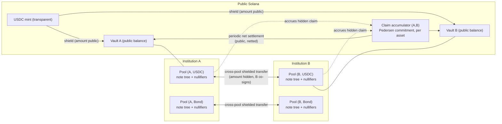
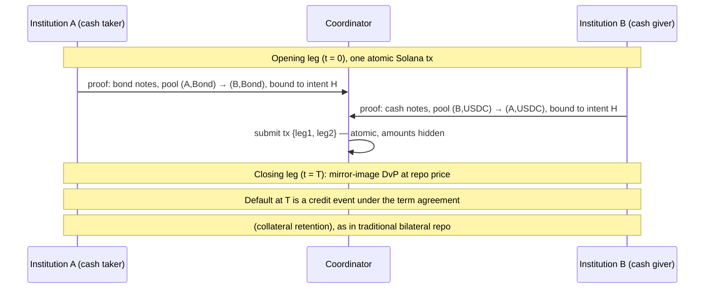

# Per-Institution Shielded Pools — High-Level Design

v2. This replaces the earlier two-layer (Zether + shared pool) design
entirely. Requirements and locked decisions are in [goal.md](goal.md); a
constraint-level spec will follow separately.

## 1. Overview

The system is a matrix of Zcash-style shielded pools, one per
(institution, asset) pair, deployed as programs on unmodified Solana. All
proofs run on a single stack: Groth16 over BN254, Baby Jubjub as the
embedded curve, Poseidon for hashing.

Every institution custodies the assets it handles in its own pools, so one
institution's resting funds (and its clients') never enter another
institution's pool. Value moves between institutions through cross-pool
shielded transfers: a note is burned in pool (A, X) and minted in pool
(B, X) under a ZK conservation proof, with the amount never public. Each
such transfer accrues a bilateral claim from A to B, and claims are
net-settled periodically in the public base asset (D1).

Amounts and balances are hidden everywhere inside the system. Within a
pool, unlinkability comes from membership proofs over the whole note set,
and zero-value dummy transactions are indistinguishable from real ones by
construction. The issuing institution can audit its own asset through
circuit-enforced auditor ciphertexts — read-only, no spend authority.
Repo/DvP is built from Solana transaction atomicity plus an intent-hash
binding in each leg's proof (D3); there is no shielded VM and no binding
signatures.

Compared to v1, the following no longer exist: the shared anonymity pool,
hidden asset IDs, the ZK registry-membership machinery, the Zether account
layer, and the curve25519/BN254 gap.

## 2. Architecture

### 2.1 The pool unit

A pool is identified by (custodian institution, asset) and consists of a
note commitment tree (Poseidon Merkle tree, each leaf committing to value,
owner key, and randomness — no asset field, since the pool itself fixes the
asset), a nullifier set for double-spend prevention, the custodian's audit
public key, and, for wrapped public assets, a public vault holding the
base-asset backing.

Clients of institution A hold notes in A's pools. In-pool transfers
between two clients of the same institution are standard shielded actions:
spend notes, emit nullifiers, create output notes, prove conservation and
range in ZK. Transactions have a fixed arity (say 2-in/2-out, padded with
zero-value notes) so every transaction has the same shape.

### 2.2 Entry and exit

For a wrapped public asset like USDC, a user deposits public USDC into the
pool's vault and receives a note; unshield is the reverse. Boundary
amounts against a transparent base asset are necessarily public — the
wrapped-mint variant discussed earlier has exactly the same property, since
the USDC-to-wrapped-token conversion is equally visible. Everything after
the boundary is hidden.

Natively confidential assets (say a bond issued by institution A) are
different: issuance mints notes directly into the pool with no public
amount at all. There is no vault and no public base, and outstanding
supply is known only to the issuer via its audit key.

### 2.3 Cross-pool shielded transfer

This is the one mechanism for moving value between institutions. To move
from pool (A, X) to pool (B, X):

1. The sender spends notes in (A, X) — nullifiers against A's tree — and
   creates output notes in (B, X), in one proof spanning both trees.
   Conservation and range are proven in ZK; the amount is never public.
2. The output notes carry auditor ciphertexts under B's audit key, since B
   now custodies them, and the transfer also carries an amount ciphertext
   under A's key. So both counterparties, and only they, learn the amount.
3. B co-signs the transaction. This is B accepting A's IOU, and it doubles
   as real-time exposure control: B decrypts the incoming amount and can
   refuse to sign past its credit limit with A.
4. The on-chain claim accumulator for the ordered pair (A→B, X) — a
   Pedersen commitment — is updated homomorphically, with the circuit
   proving the update matches the hidden transferred amount. Both
   institutions track the plaintext net position off-chain, since each can
   decrypt every transfer; nobody else can.

Note the co-signing requirement in step 3 is our assumption, not something
that came out of the discussions. It matches how correspondent banking
works (a bank has to accept an incoming credit), but it also means an
institution must run an online signing service to receive transfers. Needs
confirmation — see [questions.md](questions.md).

### 2.4 Settlement

Bilateral claims are backed by bilateral credit lines with periodic net
settlement (D1). At each settlement, A and B co-sign the plaintext net
position for the period (both already know it), the on-chain program
checks the co-signature and optionally a ZK opening of the accumulator,
the net amount moves between vaults in the public base asset, and the
accumulator resets. Natively confidential assets have no public base, so
settlement there is issuer-mediated: the issuer burns claim-backing notes
in one pool and mints in the other, confidentially.

Being precise about what R2 actually gets us for public assets: vault
balances are public at all times, and each settlement reveals one net flow
per counterparty pair per period. What's hidden is everything else — every
individual transfer, all amounts and counterparties, all gross flows, and
the divergence between vault balances and true positions (the outstanding
intra-period claims). The settlement cadence is the knob: longer periods
leak less and carry more bilateral credit exposure, and it's configured
per institution pair rather than fixed by the protocol. For natively
confidential assets, TVL and supply are fully hidden from everyone but the
issuer. This is the same guarantee the wrapped-mint scheme from the
discussions actually provides; we're just stating it precisely.

## 3. Anonymity

Within a pool, deposits and withdrawals are unlinkable via membership
proofs over the full note set — the anonymity set is the entire history of
the pool, not a sender-chosen ring. (Ring-based designs were rejected for
weaker privacy and 10–27 KB transactions.)

Dummy traffic is what makes small pools workable. Zero-value notes are
native to the action structure, and since all amounts are hidden and all
transactions are shape-identical, dummy churn and real transfers are
indistinguishable. An institution or its relayer can inflate its pool's
apparent volume at will. Fee economics and cadence are still open
(goal.md, open question 4).

Across pools there is a known leak: a cross-pool transfer touches both
pool programs, so the pair of institutions (not the amount, not the
parties within each pool) is publicly visible. If that's not acceptable,
the mitigations are scheduled zero-value cross-pool dummies and/or routing
through an intermediary program. Whether it's needed is a question for the
institutional side (questions.md, Q2).

## 4. Auditability

Every output note carries an auditor ciphertext: an exponential ElGamal
encryption (over Baby Jubjub) of the note's value under the custodian's
registered audit key, with the circuit constraining it to match the
committed value. So the custodian can decrypt the values flowing through
its own pools, with no trusted third party, but cannot decrypt any other
institution's traffic, and its audit key confers no spend authority —
audit is strictly read-only, and forced forfeiture is deliberately
unsupported. For cross-pool transfers both counterparties get an amount
ciphertext (§2.3), which doubles as the data source for claim tracking.
The issuer of a natively confidential asset can additionally verify
no-inflation of its own supply and may publish proof-of-reserve
attestations without revealing values.

Since pools are per-institution and publicly attributable, v1's machinery
for hiding which asset is being audited (ZK registry membership, per-asset
value bases) has no purpose here and is gone.

## 5. Repo / DvP

The pool core is transfer-only; conditional settlement composes at the
Solana layer. A DvP is two legs in different pools, each proven
independently by the party holding that leg's witnesses, bundled into one
Solana transaction. Native atomicity makes the legs all-or-nothing — no
central securities depository, no Orchard-style binding signatures, no
circuit changes. Each leg's proof binds an intent hash, a public input
committing to both legs' conditions, so a leg fished out of the mempool
can't be replayed standalone. A stateless coordinator program (or an
off-chain coordinator) assembles the transaction and can enforce expiry.

A repo is two DvPs plus a term agreement:

Third parties see only that two shielded operations touched two pool
pairs. No amounts, no instruments, no rate. Whether the closing leg
actually executes at maturity is a credit/legal matter, exactly as in
traditional bilateral repo — the protocol doesn't try to enforce future
obligations in-circuit.

## 6. Cryptographic toolkit

One proving stack, no curve gap:

- Groth16 over BN254: 200-byte proofs, 3-pairing verification via Solana's
  `alt_bn128` syscalls. Plonk-KZG (1–3 KB proofs) is a drop-in fallback if
  the trusted-setup ceremony becomes a blocker.
- Baby Jubjub for all in-circuit group operations (auditor ElGamal, key
  derivation).
- Poseidon for note commitments, nullifiers, and Merkle trees.
- Pedersen commitments over Baby Jubjub for the claim accumulators.
- Range proofs by bit decomposition inside the same circuit.

Circuits: `C_transfer` (in-pool), `C_shield` / `C_unshield` (vault
boundary), `C_crosspool` (two-tree spend/output plus accumulator update),
`C_issue` (confidential issuance). The asset dimension, registry tree, and
Zether-layer circuits from v1 are gone.

On transaction size (R9): a transaction is dominated by one Groth16 proof
(~200 B) plus nullifiers, note commitments, and ciphertexts per action,
which fits current Solana limits with room to spare. The worst case is
`C_crosspool` with a co-signature; the spec needs to account for it
precisely.

Token-2022 confidential-transfer interop is an optional adapter — a
cross-curve equality proof at the vault boundary (S1) — and never touches
pool circuits.

## 7. Comparison

| | Zcash / Orchard | Orchard ZSA | v1 | v2 (this design) |
|---|---|---|---|---|
| Pool topology | one global pool | one global pool, multi-asset | one shared pool, hidden asset IDs | one pool per (institution, asset) |
| Commingling of institutions' funds | yes | yes | yes (in-tree) | none |
| Asset identity in a transfer | n/a | public | hidden (ZK registry) | public by construction; nothing to hide |
| Amounts / balances | hidden | hidden | hidden | hidden |
| TVL / supply | public | public issuance map | issuer-only | hidden (fully for native assets; up to netted settlements for wrapped public assets) |
| Anonymity set | global | global | union of all institutions | per-pool, inflatable with dummies |
| Inter-institution transfer | n/a | n/a | in-pool | cross-pool + bilateral netting |
| Repo / DvP | no | no | out of scope | Solana atomicity + intent hash |
| Extra layers | — | — | Zether L1 per institution | none |
| Curves | Pallas/Vesta (Halo2) | same | Baby Jubjub + curve25519 gap | Baby Jubjub / BN254 only |
| Supply-integrity check | public | public, by anyone | issuer audit key | issuer audit key + optional proof-of-reserve |

Why v1 → v2: the discussions established that institutions reject fund
commingling in any shared structure, including v1's shared tree — whose
entire hidden-asset-ID apparatus existed to make sharing safe. Removing
the shared pool removes that apparatus, the Zether layer, and the curve
gap. The cost is per-pool rather than global anonymity sets, which dummy
traffic compensates for.

On inflation risk, v2 keeps ZSA's lesson in a weaker form. There is no
public supply invariant for confidential assets (that's the point), but
each issuer can continuously verify its own supply, wrapped assets are
checkable against public vault balances plus settled claims, and the
per-pool structure limits the blast radius of a soundness bug to one
institution's asset instead of a global pool.

## 8. Security properties

- No inflation: in-circuit conservation for in-pool transfers; cross-pool
  conservation ties minted value in B to burned value in A and to the
  claim accumulator. Vault solvency for wrapped assets (vault balance plus
  net claims covers outstanding notes) is issuer-verifiable.
- Isolation is structural: distinct trees, nullifier sets, and programs
  per institution.
- Unlinkability rests on membership-proof anonymity over the full pool,
  under DDH on Baby Jubjub and Poseidon behaving like a random oracle.
- Dummy indistinguishability holds by construction: uniform transaction
  shape, hidden amounts, zero-value notes valid in-circuit.
- Auditor-ciphertext correctness is circuit-enforced; audit secrecy
  reduces to the audit key staying private.
- A compromised Groth16 setup breaks soundness (inflation, with per-pool
  blast radius), not anonymity. Plonk-KZG's universal setup is the
  fallback if ceremony governance stalls.

## 9. Open questions and deferred work

Open (see [questions.md](questions.md) and goal.md):

1. Counterparty-pair visibility of cross-pool transfers — acceptable, or
   do we need dummy cross-pool traffic / routing?
2. A formal leakage model for periodic net settlement over time.
3. Cross-pool authorization details. This doc assumes receiving-
   institution co-signature; confirm that, and specify the accumulator
   opening/dispute path.
4. Dummy-traffic economics: fees, cadence, relayers.

Deferred to the spec or later:

- constraint-level circuits and worst-case transaction-size accounting
- Groth16 ceremony design vs. the Plonk-KZG decision
- pool governance: institution onboarding, audit-key rotation, freeze
- fee/relayer model for shielded transactions
- diversified/stealth addresses for repeat-payment unlinkability
- the optional token-2022 CT boundary adapter (S1)
